# FUNDAMENTOS SPRING BOOT

### **Realizado por:** Milton Chuqui

---

### **Práctica 1. Configuración del proyecto**

_1. Captura de verificación de Java._

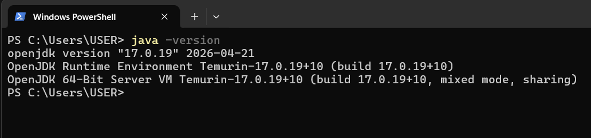

_2. Captura del servidor Srping Boot ejecutandose._

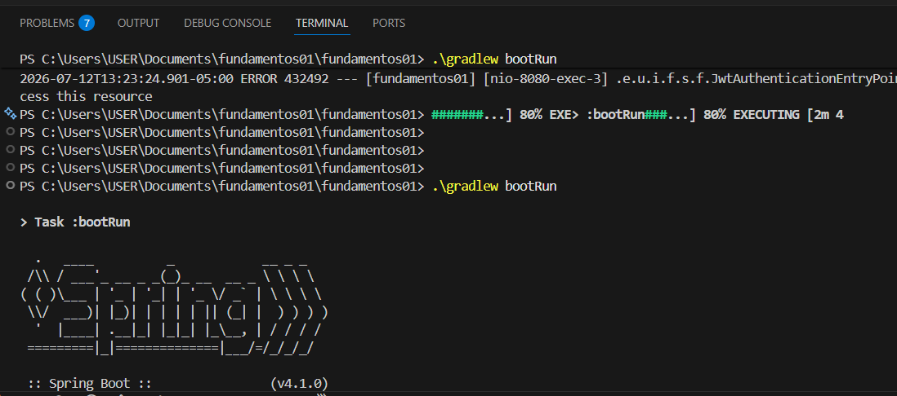

_3. Captura del endpoint /api/status_

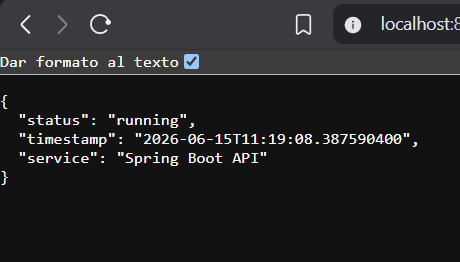

_4. Captura del comando_

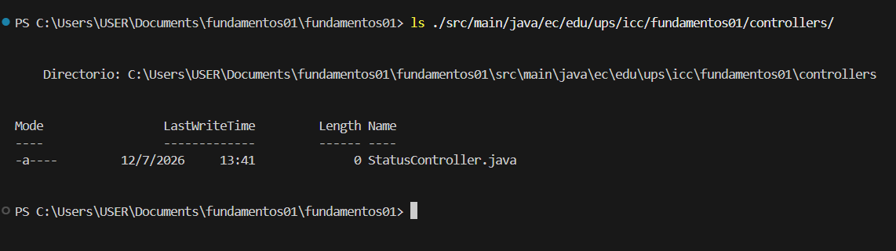

_5. Explicación Breve_

**¿Qué entendió sobre el funcionamiento del endpoint
y sobre la función general de Spring Boot en la
creación del servidor?**

- El endpoint /api/status es un punto de acceso que permite verificar el estado del servidor Spring Boot. Cuando se realiza una solicitud a este endpoint, el servidor responde con información sobre su estado actual, lo que indica que está funcionando correctamente.
- Spring Boot es un framework que facilita la creación de aplicaciones Java, proporcionando una configuración automática y simplificando el proceso de desarrollo. Permite a los desarrolladores crear servidores web y servicios REST de manera rápida y eficiente, manejando gran parte de la configuración y las dependencias necesarias para ejecutar la aplicación.

---

## **Práctica 2. Estructura del Proyecto, Arquitectura Interna y Organización Modular**

_1. Captura del IDE mostrando la estructura modular_

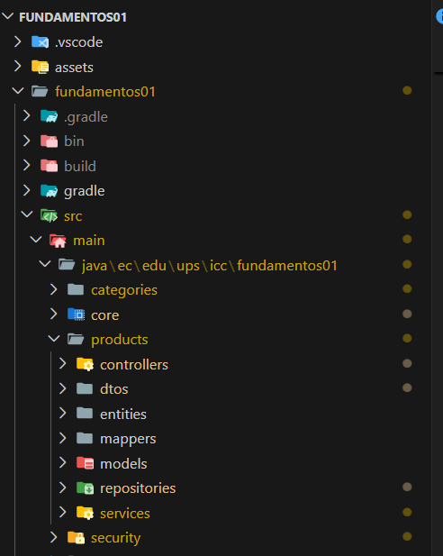

_2. Captura del archivo Fundamentos01Application.java_

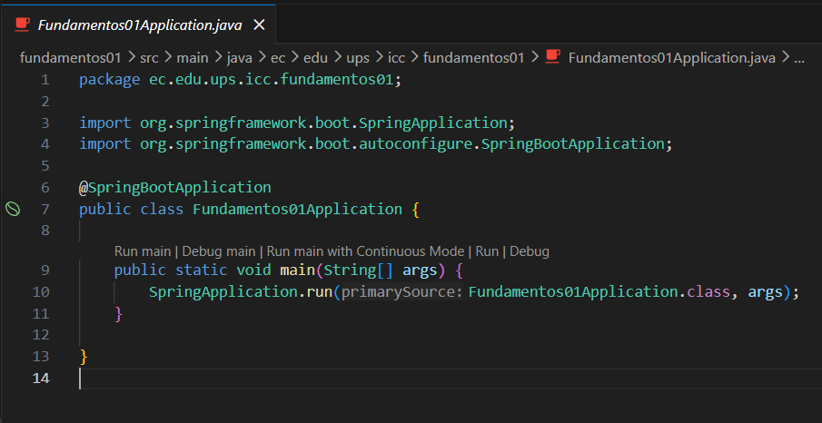

_3. Explicación breve_

**¿Por qué es importante tener módulos separados?**

- Tener módulos separados es importante porque permite una mejor organización del código, facilita el mantenimiento y la escalabilidad del proyecto. Cada módulo puede enfocarse en una funcionalidad específica, lo que reduce la complejidad y mejora la legibilidad del código. Además, los módulos separados permiten la reutilización de componentes y facilitan las pruebas unitarias, ya que cada módulo puede ser probado de manera independiente.

---

## **Práctica 3. Construcción de una API REST usando controladores, DTOs, modelos y mappers**

En esta práctica se replico toda la estructura de /api/users y se creo la estructura de /api/products, con sus respectivos controladores, DTOs, modelos y mappers.

Los campos del producto son los siguientes:

```java
private Long id;
private String name;
private Double price;
private Integer stock;
private LocalDateTime createdAt;
```

**1. Implementar los 6 endpoints REST para productos**

Con funcionamiento idéntico al de usuarios.

- Endpoints disponibles

| Método | Ruta                | Descripción                 |
| ------ | ------------------- | --------------------------- |
| GET    | `/api/products`     | Lista productos             |
| GET    | `/api/products/:id` | Obtiene producto            |
| POST   | `/api/products`     | Crea producto               |
| PUT    | `/api/products/:id` | Reemplaza producto completo |
| PATCH  | `/api/products/:id` | Actualiza parcialmente      |
| DELETE | `/api/products/:id` | Elimina producto            |

**2. Evidencias**

_1. Captura de consumo de endpoints de Products desde Bruno._

```http
GET /api/products         / Con 3 preductos creados
```

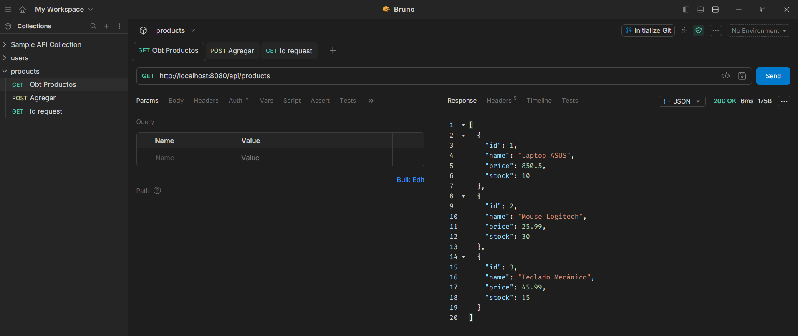

```http
GET /api/products/:id          / Con un producto existente
```

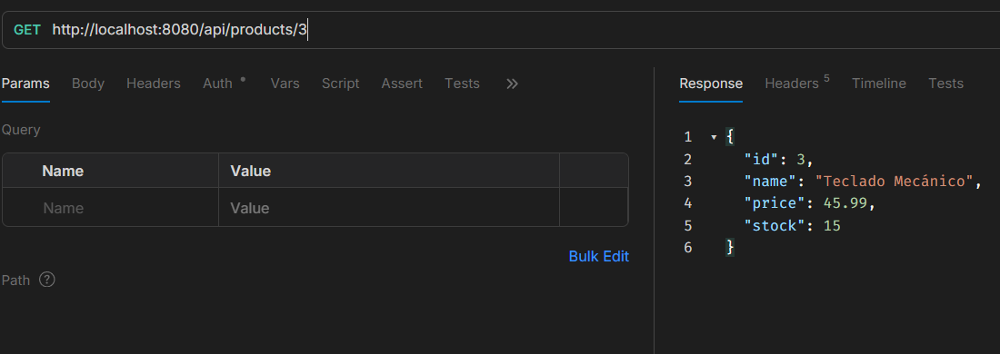

```http
DELETE /api/products/:id       / Eliminando un producto existente
```

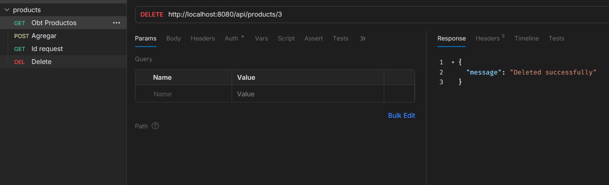

```http
DELETE /api/products/:id       / Eliminando un producto que no existe
```

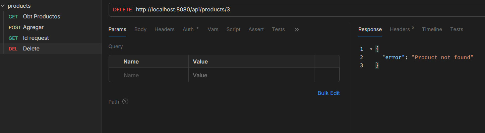

---

## **Práctica 4. Controladores + Servicios + Lógica de Negocio**

En esta práctica se replicó toda la estructura implementada en `users/` para el recurso de `products/`.

### **1. Código completo de `ProductServiceImpl.java`**

```java
@Service
public class ProductServiceImpl implements ProductService {

    private final List<ProductModel> products = new ArrayList<>();
    private Long currentId = 1L;

    @Override
    public List<ProductResponseDto> findAll() {
        return products.stream()
                .map(ProductMapper::toResponse)
                .toList();
    }

    @Override
    public Object findOne(Long id) {
        return products.stream()
                .filter(product -> product.getId().equals(id))
                .findFirst()
                .map(product -> (Object) ProductMapper.toResponse(product))
                .orElseGet(() ->
                        new ErrorResponseDto("Product not found"));
    }

    @Override
    public ProductResponseDto create(CreateProductDto dto) {

        ProductModel product = ProductMapper.toModel(dto);

        product.setId(currentId);
        currentId++;

        products.add(product);

        return ProductMapper.toResponse(product);
    }

    @Override
    public Object update(Long id, UpdateProductDto dto) {

        ProductModel product = products.stream()
                .filter(item -> item.getId().equals(id))
                .findFirst()
                .orElse(null);

        if (product == null) {
            return new ErrorResponseDto("Product not found");
        }

        product.setName(dto.getName());
        product.setPrice(dto.getPrice());
        product.setStock(dto.getStock());

        return ProductMapper.toResponse(product);
    }

    @Override
    public Object partialUpdate(
            Long id,
            PartialUpdateProductDto dto) {

        ProductModel product = products.stream()
                .filter(item -> item.getId().equals(id))
                .findFirst()
                .orElse(null);

        if (product == null) {
            return new ErrorResponseDto("Product not found");
        }

        if (dto.getName() != null) {
            product.setName(dto.getName());
        }

        if (dto.getPrice() != null) {
            product.setPrice(dto.getPrice());
        }

        if (dto.getStock() != null) {
            product.setStock(dto.getStock());
        }

        return ProductMapper.toResponse(product);
    }

    @Override
    public Object delete(Long id) {

        boolean removed = products.removeIf(
                product -> product.getId().equals(id));

        if (!removed) {
            return new ErrorResponseDto("Product not found");
        }

        return new Object() {
            public String message = "Deleted successfully";
        };
    }
}
```

### **Elementos implementados**

- **Uso de `@Service`:** permite que Spring reconozca la clase como un servicio y gestione su instancia.

- **Lista en memoria:** los productos se almacenan temporalmente en un `ArrayList`.

- **Generación de ID:** la variable `currentId` asigna un identificador único a cada producto creado.

- **Uso del mapper:** `ProductMapper` convierte los DTOs en modelos y los modelos en DTOs de respuesta.

- **Métodos CRUD implementados:** se incluyeron los métodos para listar, buscar, crear, actualizar, actualizar parcialmente y eliminar productos.

### **2. Código completo de `ProductsController.java`**

```java
@RestController
@RequestMapping("/products")
public class ProductsController {

    private final ProductService service;

    public ProductsController(ProductService service) {
        this.service = service;
    }

    @GetMapping
    public List<ProductResponseDto> findAll() {
        return service.findAll();
    }

    @GetMapping("/{id}")
    public Object findOne(@PathVariable Long id) {
        return service.findOne(id);
    }

    @PostMapping
    public ProductResponseDto create(
            @RequestBody CreateProductDto dto) {

        return service.create(dto);
    }

    @PutMapping("/{id}")
    public Object update(
            @PathVariable Long id,
            @RequestBody UpdateProductDto dto) {

        return service.update(id, dto);
    }

    @PatchMapping("/{id}")
    public Object partialUpdate(
            @PathVariable Long id,
            @RequestBody PartialUpdateProductDto dto) {

        return service.partialUpdate(id, dto);
    }

    @DeleteMapping("/{id}")
    public Object delete(@PathVariable Long id) {
        return service.delete(id);
    }
}
```

### **Elementos implementados**

- **Inyección de `ProductService`:** el servicio se recibe mediante el constructor y se almacena en la variable `service`.

- **Endpoints llamando al servicio:** cada endpoint delega su operación al método correspondiente de `ProductService`.

- **Ausencia de lógica CRUD en el controlador:** el controlador únicamente recibe las solicitudes y llama al servicio. La búsqueda, creación, actualización y eliminación de productos se realizan en `ProductServiceImpl`.

### **3. Explicación breve: inyección del servicio**

El servicio se inyecta mediante el constructor de `ProductsController`.

```java
private final ProductService service;

public ProductsController(ProductService service) {
    this.service = service;
}
```

Spring detecta la implementación de `ProductService` anotada con `@Service`, crea su instancia y la entrega automáticamente al controlador.

---

## **Práctica 5: Persistencia real con PostgreSQL, Entidades JPA y Repositorios**

- **Captura de 5 productos creados en PostgreSQL**

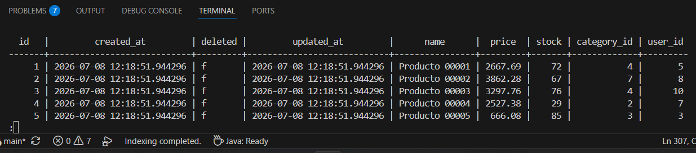

- **Captura de los cambios realizados en productos de la actividad práctica 5**

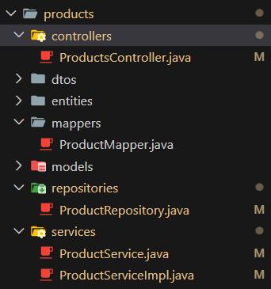

---

## **Práctica 6: Validación de DTOs y Control de Datos de Entrada**

Se implementó la validación de DTOs para el recurso de productos, asegurando que los datos de entrada cumplan con las reglas definidas antes de ser procesados por el servicio.

- **Captura de respuesta de error al enviar un POST inválido**

Post usado para la prueba:

```json
{
  "name": "",
  "price": -5,
  "stock": -1
}
```

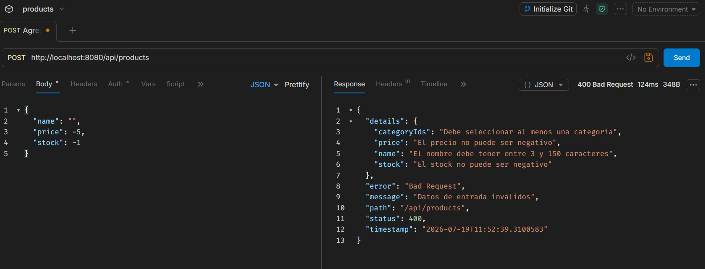

- **Error al actulizar producto eliminado**

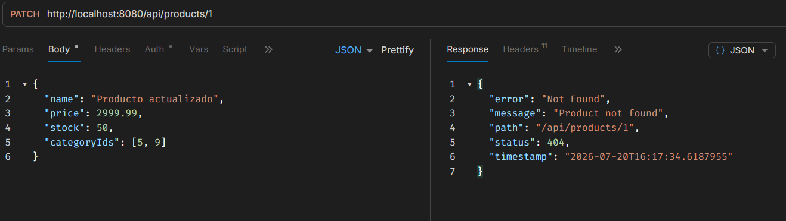

- **findAll no devuelve productos eliminados**

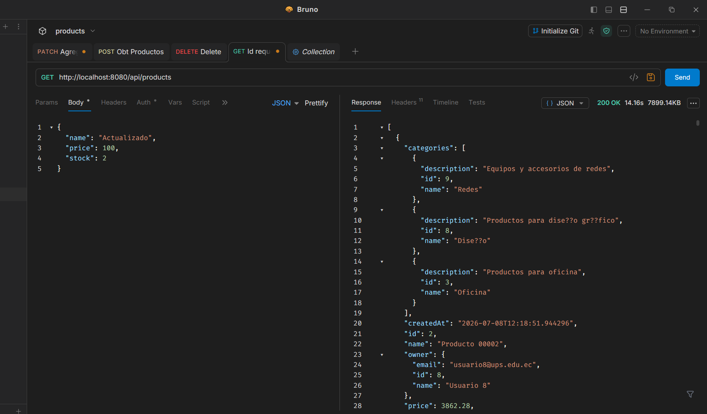

---

## **Práctica 7: Manejo Global de Errores y Excepciones**

Se implementó un manejo global de errores y excepciones para capturar y procesar los errores de manera uniforme en toda la aplicación, proporcionando respuestas consistentes y claras a los clientes.

- **Captura de error por producto inexistente**

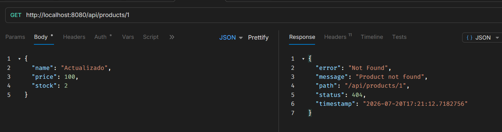

- **Captura de error por producto duplicado**

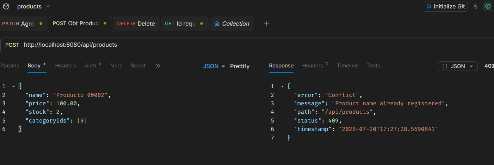

- **Captura de error por validación de DTO**

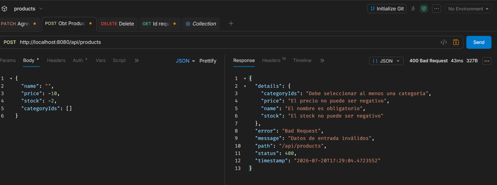

---

## **Práctica 8: Relaciones ManyToOne, Foreign Keys y Consultas Relacionales**

En esta práctica se implementaron relaciones entre entidades usando JPA,
Se trabajará con relaciones:

```json
User 1 ──── N Product
Category 1 ──── N Product
```

Esto significa:

```json
Un usuario puede registrar muchos productos.
Una categoría puede tener muchos productos.
Un producto pertenece a un usuario.
Un producto pertenece a una categoría.
```

- **Captura de descripcion de la tabla products en PostgreSQL**

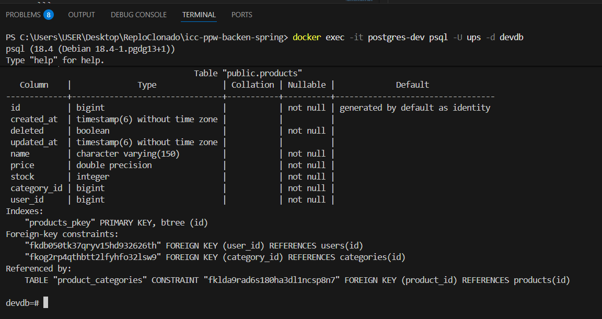

- **Captura de respuesta en bruno de la creación de Producto con sus relaciones**

Debe evidenciar:

- objeto anidado owner
- objeto anidado category
- campos de fecha

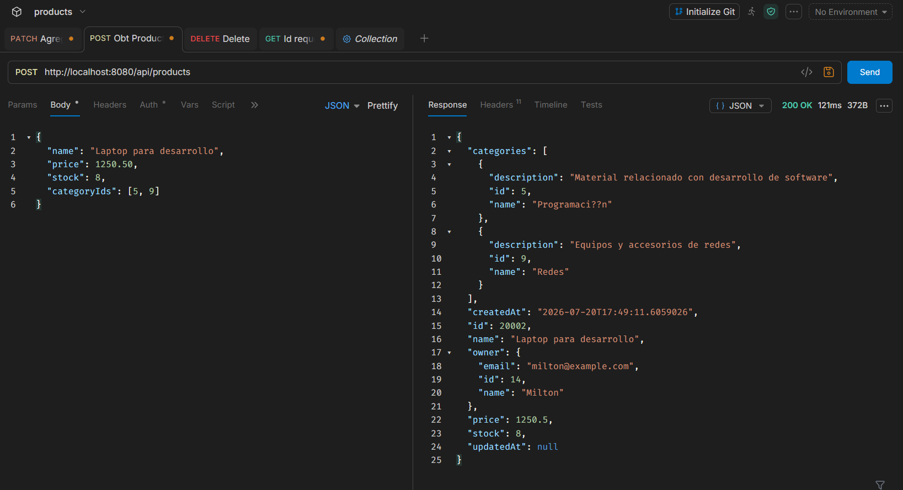

- **Captura de consulta de productos por categoría**

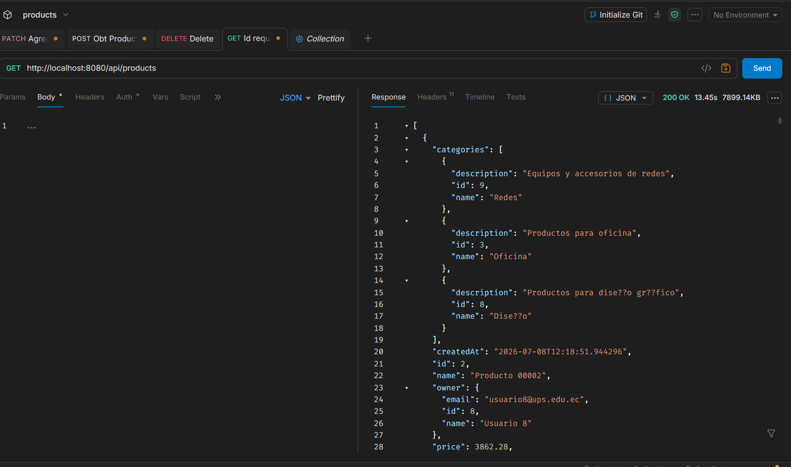

- **Explicación Breve**

¿Cómo se relaciona ProductEntity con UserEntity y CategoryEntity usando @ManyToOne y @JoinColumn?

Se utiliza la anotación `@ManyToOne` en la entidad `ProductEntity` para indicar que cada producto está asociado a un único usuario y a una única categoría. La anotación `@JoinColumn` se utiliza para especificar la columna de la base de datos que actúa como clave foránea, estableciendo así la relación entre las tablas correspondientes en la base de datos.

---

## **Práctica 9: Request Parameters, Consultas Relacionadas y Filtrado con JPA**

En esta práctica se implemetó consultas relacionadas y filtros usando la relación actual:

```json
User 1 ──── N Product Category 1 ──── N Product
```

Luego se evolucionará la relación entre productos y categorías hacia:

```json
Product N ──── N Category
```

- **Captura de producto creado con varias categorías**

Ejemplo usado:

```json
{
  "name": "Laptop Gaming",
  "price": 1200.0,
  "stock": 5,
  "userId": 1,
  "categoryIds": [1, 2, 3]
}
```

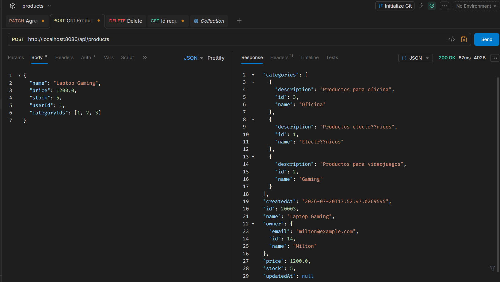

- **Captura de consulta con filtros por categoría**

Ejemplo usado:

```json
GET /api/categories/2/products?userId=1
```

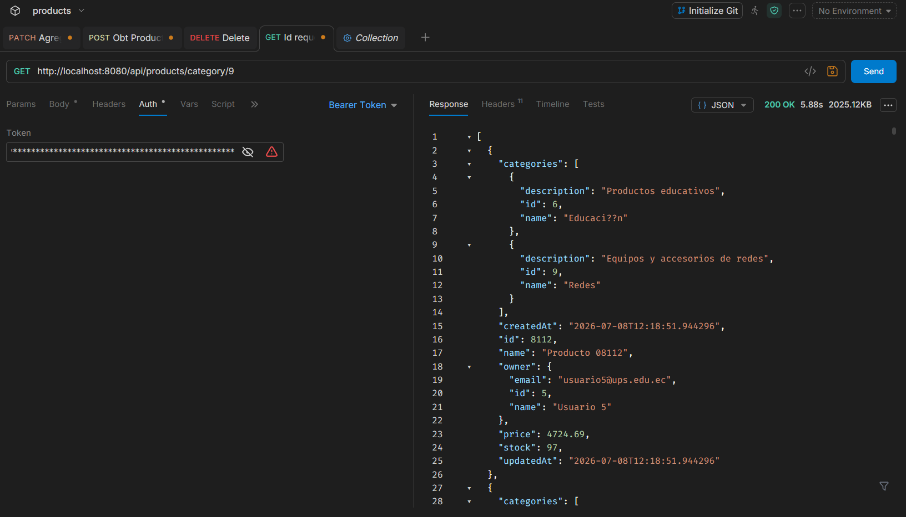

- **Explicación Breve:**

**¿Por qué se usa ProductService y ProductRepository para consultar productos aunque el endpoint esté dentro del contexto /users/{id}/products o /categories/{id}/products?**

Porque el servicio y el repositorio de productos encapsulan la lógica de negocio y el acceso a datos relacionados con los productos. Aunque los endpoints estén dentro del contexto de usuarios o categorías, la consulta de productos sigue siendo responsabilidad del `ProductService` y `ProductRepository`, ya que estos componentes manejan la interacción con la base de datos y aplican las reglas de negocio necesarias para obtener los productos correctos según los filtros proporcionados.

**¿Qué cambió al pasar de Product N ──── 1 Category a Product N ──── N Category?**

Con la relación N a N, un producto puede pertenecer a múltiples categorías y una categoría puede contener múltiples productos. Esto permite una mayor flexibilidad en la organización de los productos y facilita la búsqueda y filtrado de productos por varias categorías al mismo tiempo. Además, se requiere una tabla intermedia para gestionar las relaciones entre productos y categorías.

---

## **Práctica 10: Paginación de Productos con Page, Slice y Pageable**

En esta práctica se implementa paginación usando Spring Data JPA.

Se trabajará con:

- `Page`
- `Slice`
- `Pageable`
- `PageRequest`
- `Sort`
- endpoints paginados separados
- validación de parámetros de paginación
- productos con relaciones anidadas

En esta práctica se mantendrá el endpoint normal:

```txt
GET /api/products
```

y se agregarán endpoints nuevos para paginación:

```txt
GET /api/products/page
GET /api/products/slice
```

Al final, la actividad práctica consistirá en aplicar el mismo concepto al endpoint:

```txt
GET /api/categories/{id}/products
```

creando versiones paginadas.

- **Captura de respuesta con Page**

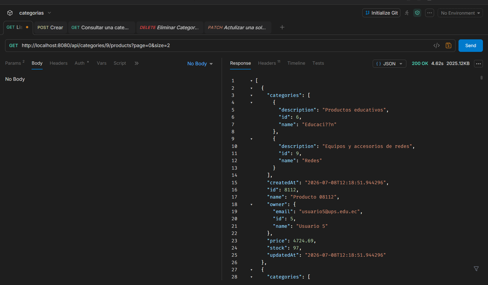

- **Captura de respuesta con Slice**


- **Captura de error por paginación inválida**


- **Captura de endpoint de categoría paginado**


- **Captura de endpoint de categoría paginado**


- **Explicación Breve**

**¿Cuál es la diferencia entre Page y Slice?**

La diferencia principal entre `Page` y `Slice` radica en la información que proporcionan sobre la paginación:

**¿Por qué la paginación debe aplicarse en el repositorio y no después de traer todos los datos en memoria?**

Porque aplicar la paginación en el repositorio permite que la base de datos realice la consulta de manera eficiente, devolviendo solo los registros necesarios para la página solicitada. Esto reduce el uso de memoria y mejora el rendimiento, especialmente cuando se trabaja con grandes conjuntos de datos. Si se trajeran todos los datos a memoria y luego se aplicara la paginación, se desperdiciaría recursos y tiempo, ya que se cargarían muchos registros innecesarios.

---

## **Práctica 11: Autenticación JWT, Autorización por Roles y Protección de Endpoints**

En esta práctica implementaremos:

- **Autenticación**: Verificar quién es el usuario (login)
- **Autorización**: Verificar qué puede hacer el usuario (permisos/roles)
- **Protección de endpoints**: Solo usuarios autenticados pueden acceder
- **Control de ownership**: Solo el propietario puede modificar sus recursos

* **Captura de registro exitoso**


- **Captura de login exitoso**


- **Captura de endpoint protegido sin token**


- **Captura de endpoint protegido con token**


---

## **Práctica 12: Protección de Endpoints con Roles**

En esta práctica se implemeto:

- Proteger endpoints específicos con roles
- Usar @PreAuthorize para control de acceso
- Inyectar usuario actual con @AuthenticationPrincipal
- Diferenciar entre endpoints públicos y protegidos

- **Captura de usuario autenticado**


- **Captura de acceso denegado por rol**


- **Captura de acceso permitido por rol ADMIN**


- **Explicación breve**

**¿Cuál es la diferencia entre autenticación y autorización?**

La autenticación es el proceso de verificar la identidad de un usuario, asegurándose de que es quien dice ser, generalmente mediante credenciales como nombre de usuario y contraseña. La autorización, por otro lado, es el proceso de determinar qué acciones o recursos puede acceder un usuario autenticado, basándose en sus permisos o roles asignados.

**¿Por qué GET /api/products debe ser solo para ADMIN, mientras GET /api/products/page puede ser consumido por cualquier usuario autenticado?**

GET /api/products es un endpoint que devuelve todos los productos, lo cual puede ser considerado información sensible o crítica. Por lo tanto, solo los usuarios con el rol de ADMIN deberían tener acceso a esta información. En cambio, GET /api/products/page devuelve una página de productos, lo cual no es tan crítico y puede ser accedido por cualquier usuario autenticado.

---

## **Práctica 13: Validación de Propiedad de Recursos**

En esta práctica se implementó:

- Validar propiedad de recursos (ownership)
- Implementar validateOwnership() en servicios
- Permitir bypass de ADMIN
- Manejar AccessDeniedException correctamente

- **Captura de creación de producto con usuario autenticado**


- **Captura de bloqueo por producto ajeno**


- **Captura de eliminación de producto ajeno bloqueada**


- **Captura de ADMIN modificando producto ajeno**


- **Explicación breve**

**¿Qué es ownership?**

Ownership se refiere a la propiedad de un recurso dentro de una aplicación. En el contexto de esta práctica, significa que un usuario tiene control sobre los recursos que ha creado, como productos, y puede realizar acciones como actualizar o eliminar esos recursos. La validación de ownership asegura que solo el propietario del recurso o un usuario con privilegios especiales (como un ADMIN) pueda modificarlo o eliminarlo.

**¿Por qué no es seguro recibir userId en CreateProductDto?**

No es seguro recibir userId en CreateProductDto porque permitir que el cliente especifique el userId podría llevar a problemas de seguridad, como la creación de productos en nombre de otros usuarios. Esto podría permitir a un usuario malintencionado crear productos asociados a otro usuario sin su consentimiento. En su lugar, el sistema debe determinar automáticamente el userId del usuario autenticado que está realizando la solicitud, garantizando así que los productos se creen correctamente bajo la propiedad del usuario que los creó.

**¿Cuál es la diferencia entre autorización por rol y autorización por ownership?**

La autorización por rol se basa en los permisos asignados a un usuario según su rol dentro del sistema (por ejemplo, ADMIN, USER). Un usuario con un rol específico puede acceder a ciertos recursos o realizar ciertas acciones independientemente de quién sea el propietario del recurso.

---

## **Practica 14: Renovación de Access Token con Refresh Token**

### Captura de login con refresh token

- **Endpoint:** `POST /api/auth/login`

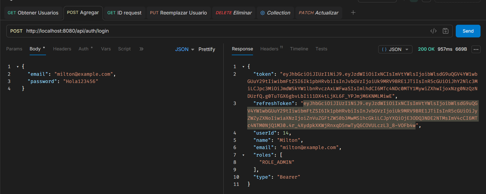

_Se evidencia en la respuesta los campos `token`, `refreshToken` y `roles`._

### Captura de refresh exitoso

- **Endpoint:** `POST /api/auth/refresh`

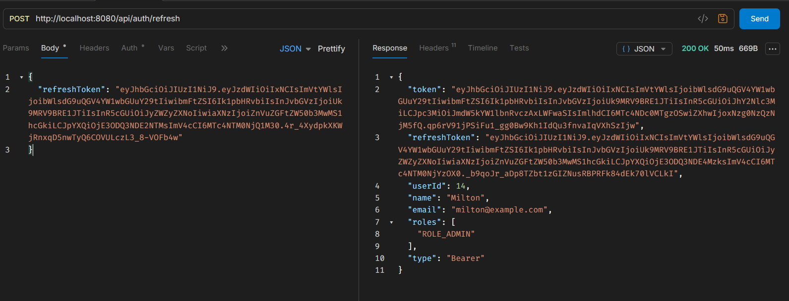

_Se evidencia respuesta `200 OK` con un nuevo `token` y un nuevo `refreshToken`._

### Captura de logout

- **Endpoint:** `POST /api/auth/logout`

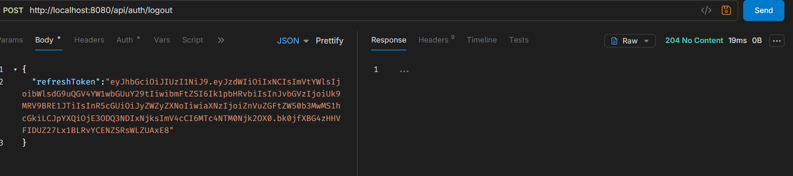

_Se evidencia respuesta `204 No Content`._

### Captura de refresh después de logout

- **Endpoint:** `POST /api/auth/refresh`

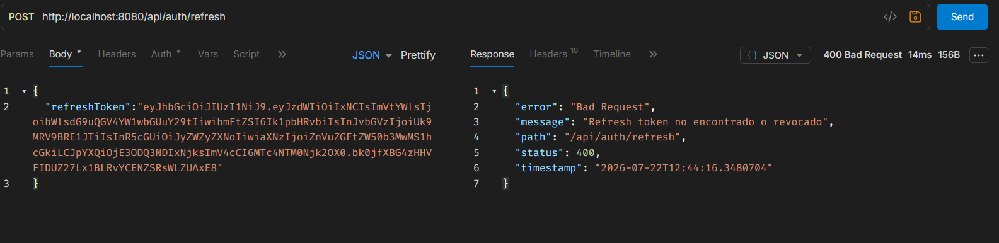

_Se evidencia respuesta `400 Bad Request` indicando que el refresh token fue revocado._

---

- ### Explicación breve

**¿Cuál es la diferencia entre access token y refresh token?**

El _access token_ (`token`) es de corta duración y se envía en cada petición protegida dentro del header `Authorization: Bearer`; permite acceder a los recursos de la API. El _refresh token_ es de mayor duración, no se usa para acceder a recursos directamente, y su único propósito es solicitar un nuevo access token cuando el anterior expira, sin obligar al usuario a volver a autenticarse con usuario y contraseña.

**¿Por qué el refresh token no debe usarse en `Authorization: Bearer`?**

Porque el refresh token no está diseñado para autorizar el acceso a los endpoints de negocio, solo para el endpoint de renovación. Si se aceptara en `Authorization: Bearer`, un refresh token filtrado tendría el mismo alcance que un access token (o incluso mayor, por su duración más larga), aumentando la superficie de ataque y facilitando que un token robado se use indefinidamente para acceder a la API.

**¿Qué significa rotar un refresh token?**

Rotar un refresh token significa que, cada vez que se usa para pedir un nuevo access token, el refresh token anterior se invalida (se revoca) y se entrega uno nuevo en su lugar. Esto evita que un mismo refresh token pueda reutilizarse varias veces; si alguien intenta reutilizar uno ya rotado, el sistema lo detecta como robado o inválido y puede revocar toda la sesión.

---

## **Práctica 15: Documentación de Endpoints con Swagger, OpenAPI y Seguridad JWT\***

### Captura de Swagger UI cargado

- **Ruta:** `/api/swagger-ui/index.html`

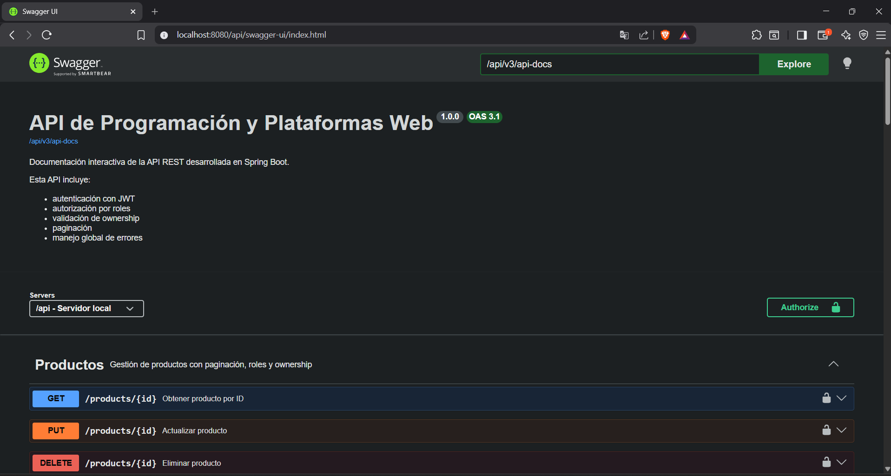

_Se evidencia la lista de controladores y los endpoints agrupados por tags._

### Captura del JSON OpenAPI

- **Ruta:** `/api/v3/api-docs`

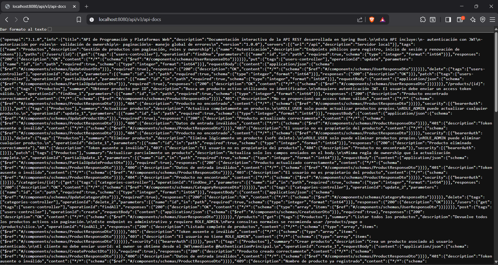

_Se evidencian las claves `openapi`, `paths` y `components`._

### Captura de AuthController documentado

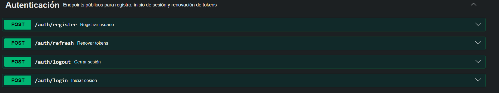

_Se evidencian los endpoints `POST /api/auth/register`, `POST /api/auth/login` y sus descripciones._

### Captura del botón Authorize

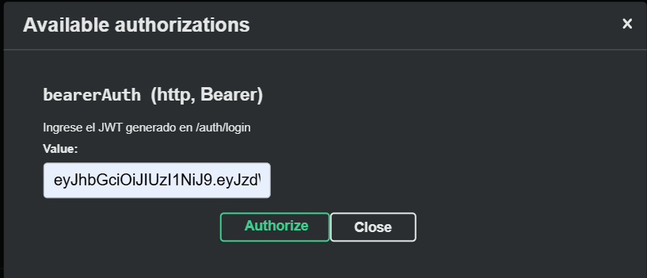

_Se evidencia el esquema `bearerAuth` con soporte `JWT`._

### Captura de endpoint protegido sin token

**Endpoint:** `GET /api/products/page?page=0&size=5`

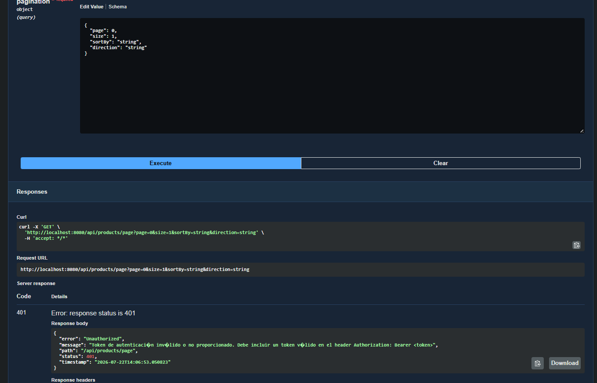

_Se evidencia respuesta `401 Unauthorized`._

### Captura de endpoint protegido con token desde Swagger

- **Endpoint:** `GET /api/products/page?page=0&size=5`

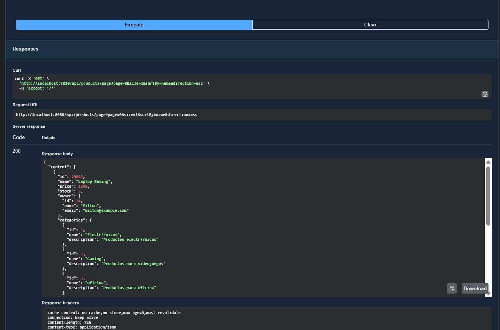

_Se evidencia respuesta `200 OK`._

### Captura de endpoint ADMIN con usuario normal

- **Endpoint:** `GET /api/products` — token con `ROLE_USER`

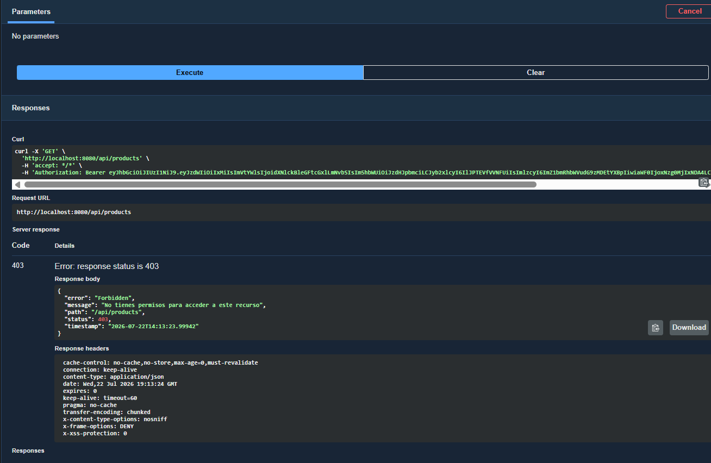

_Se evidencia respuesta `403 Forbidden`._

### Captura de endpoint ADMIN con usuario administrador

- **Endpoint:** `GET /api/products` — token con `ROLE_ADMIN`

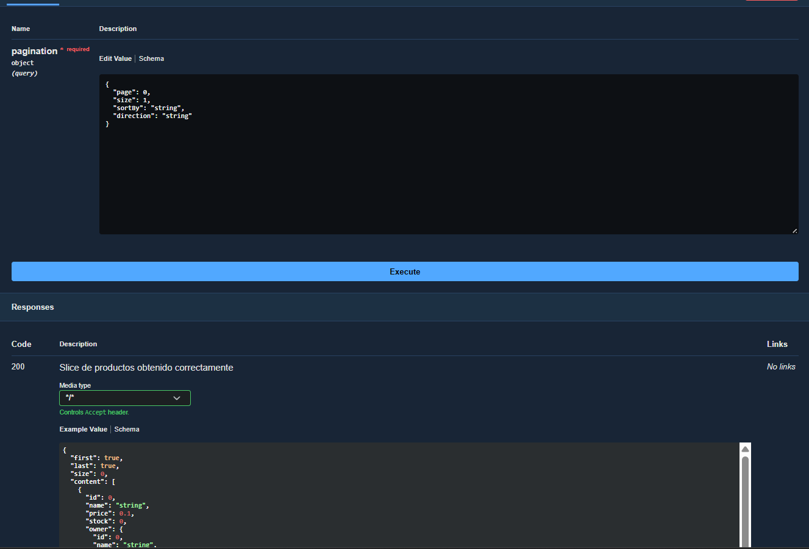

_Se evidencia respuesta `200 OK`._

- ### Explicación breve

**¿Cuál es la diferencia entre Swagger UI y OpenAPI?**

OpenAPI es la especificación (un documento JSON/YAML) que describe formalmente los endpoints, parámetros, esquemas y respuestas de la API. Swagger UI es una interfaz gráfica que lee ese documento OpenAPI y lo renderiza como una página web interactiva, permitiendo explorar y probar los endpoints sin necesidad de un cliente externo como Postman.

**¿Por qué Swagger puede ser público pero los endpoints seguir protegidos?**

Swagger UI y el JSON de OpenAPI solo muestran documentación: descripciones, esquemas y la posibilidad de enviar peticiones de prueba. La seguridad real la sigue aplicando Spring Security en cada endpoint; que la documentación esté visible no implica que se salte la validación del token JWT en las peticiones. Exponer la documentación facilita el desarrollo y las pruebas sin comprometer la protección de los recursos.

**¿Cómo se configura Swagger para enviar un JWT en `Authorization: Bearer`?**

Se define un esquema de seguridad tipo `http` con `scheme: bearer` y `bearerFormat: JWT` en la configuración de OpenAPI (por ejemplo mediante `@SecurityScheme` de springdoc-openapi), y se asocia ese esquema (`bearerAuth`) a los controladores o endpoints protegidos. Con esto, Swagger UI muestra el botón **Authorize**, donde se pega el token; a partir de ahí, Swagger agrega automáticamente el header `Authorization: Bearer <token>` en cada petición de prueba que se ejecute desde la interfaz.

---

## **Práctica 16: Despliegue portable de Spring Boot con Docker y Nginx en Ubuntu Server**

### Entregables

**1. Contenedores en ejecución (Ubuntu Server)**

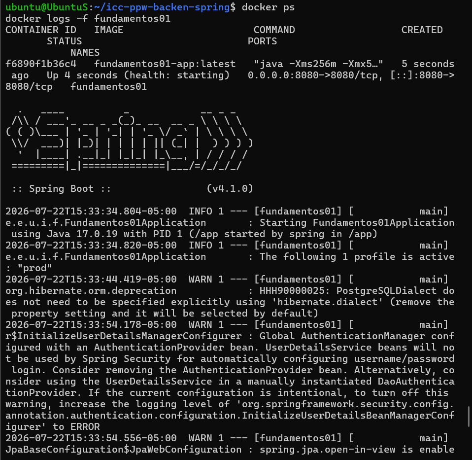

_Se evidencian los contenedores `fundamentos-api` y `nginx` en estado `Up`._

**2. Health check desde Ubuntu Server**

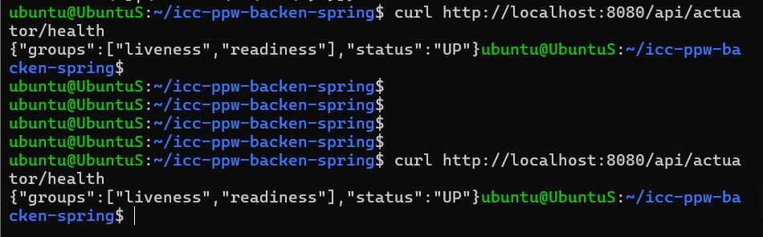

_`curl http://localhost/api/actuator/health` respondiendo `{"status":"UP"}`._

**3. Health check desde la máquina anfitriona (HOST)**

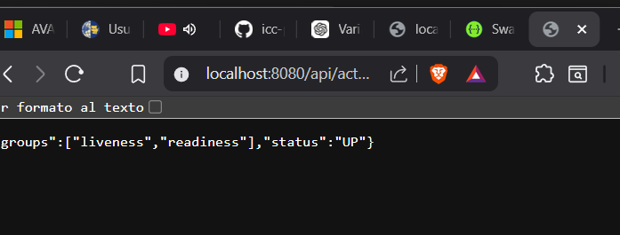

_`curl http://192.168.56.2/api/actuator/health` respondiendo `{"status":"UP"}` a través de Nginx._

**4. Conexión a PostgreSQL externo**

Se utilizó PostgreSQL instalado en la máquina anfitriona (HOST), accesible desde el contenedor mediante la red Host-Only de VirtualBox (`192.168.56.1:5432`). Se configuró `listen_addresses` en `postgresql.conf` y una regla en `pg_hba.conf` para permitir conexiones desde la subred `192.168.56.0/24`. La variable `DATABASE_URL` del contenedor apunta a esta IP, demostrando que la imagen no depende de `localhost` y puede reutilizarse contra cualquier base configurable por variable de entorno.

_(Si se usó la alternativa de contingencia, reemplazar el párrafo anterior indicando que se levantó PostgreSQL en un contenedor Docker dentro de `app-network`.)_

**5. Consumo del login desde la máquina anfitriona (Bruno/Postman)**

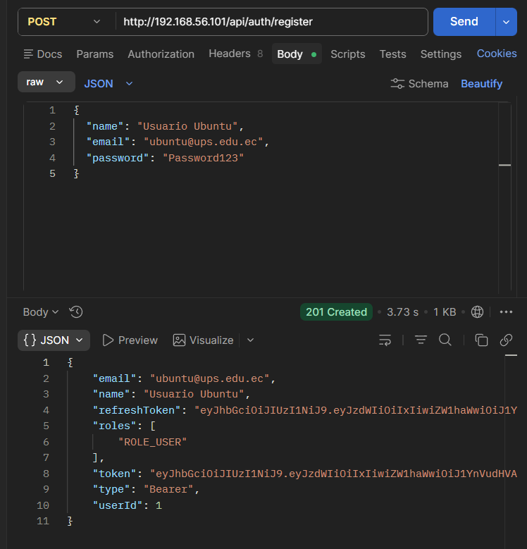

_Petición `POST /api/auth/login` ejecutada desde la HOST contra `http://192.168.56.2/api/auth/login`, mostrando respuesta exitosa con el token generado._
